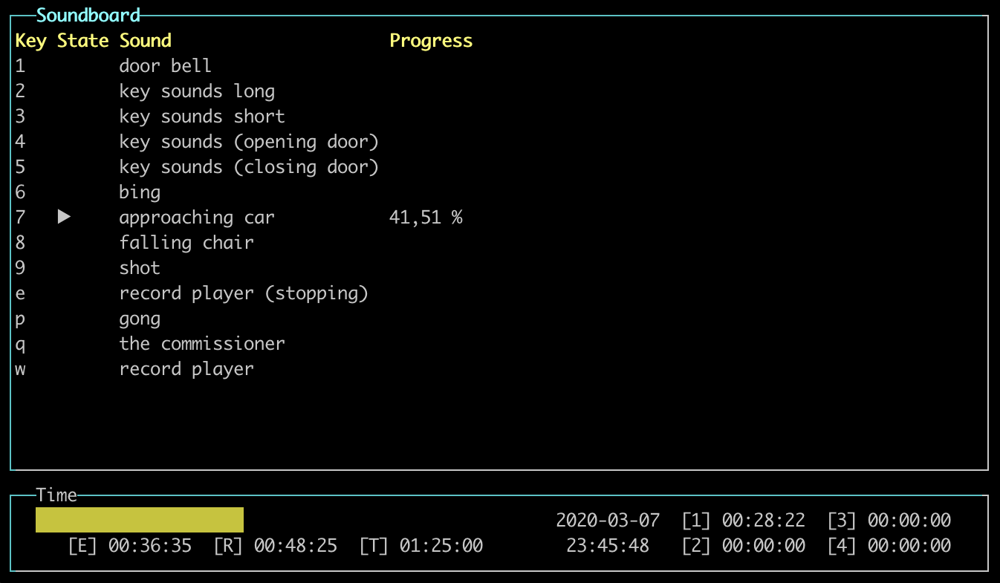

# Jhin3

Jhin3 is a console soundboard with some additional time tracking utilities. The sounds are configured through a json file. The keyboard is used as input device.



## Getting started

**You need at least Java 8 to run and/or build Jhin3.**

### Installation

There is no need to install Jhin3. You can simply run the jar file.

#### Download a pre-built version (recommended)

You can simply click [here](# "Version 2020.0.0") to download the latest version of Jhin3. Otherwise, you can navigate to the [GitHub releases page of Jhin3](https://github.com/hannesbraun/jhin3/releases) and download the desired version.
After the download is complete, simply unpack the zip file and you will find the executable jar file.

#### Building from source

Requirements:
- JDK 8 or higher
- Maven

In your console, navigate to the root directory of this project.
Run
``` bash
   mvn package
```
In the ```target``` directory, you will find your generated jar file named `jhin3-<version>-jar-with-dependencies.jar`.

### Running

Create your configuration file. This file contains the path to the sounds with their individual settings like volume and pan as well as the mappings to the keys. For an example see [sample_conf.json](sample_conf.json).

After creating the configuration file, run something like
```bash
java -jar /path/to/jhin3.jar -c /path/to/config.json
```

Use `ctrl-F` o switch between the two windows.
In the soundboard window, press a mapped key to trigger the associated sound.

For more information, please see the [manual](#).

## Used libraries

- [Lanterna](https://github.com/mabe02/lanterna)
- [JSON-java](https://github.com/stleary/JSON-java)
- [Apache Commons Lang](https://commons.apache.org/proper/commons-lang/)
- [Apache Commons CLI](https://commons.apache.org/proper/commons-cli/)

## License

Jhin3 is released under the GNU General Public License version 3. For more information see [LICENSE](LICENSE "GPL v3").
